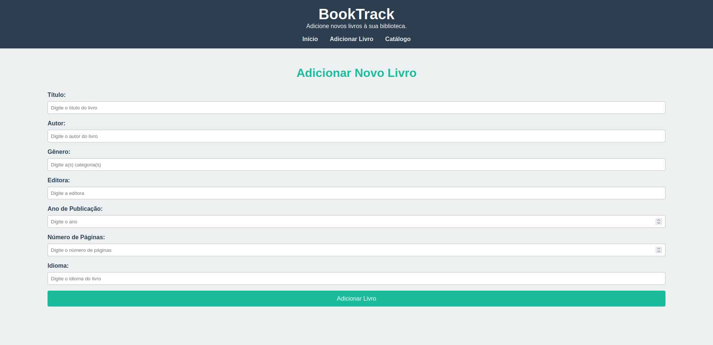
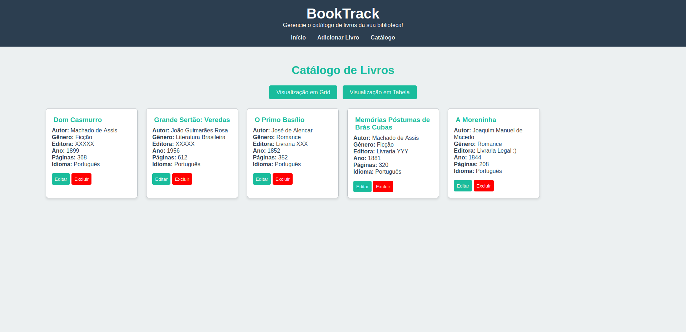
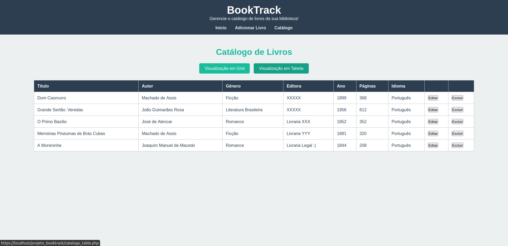
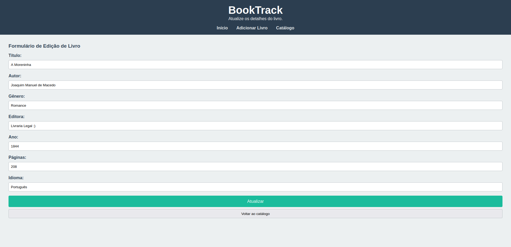

# Sistema de Gestão de Biblioteca - BookTrack

Este é um projeto desenvolvido para a disciplina de **Introdução ao Desenvolvimento de Sistemas** no **1º semestre da faculdade**. O objetivo foi criar um sistema simples de gerenciamento de livros, permitindo o cadastro e visualização de livros em uma biblioteca.

## Tecnologias Utilizadas

- **HTML**: Estruturação das páginas web.
- **CSS**: Estilização das páginas e criação de layout.
- **PHP**: Lógica de backend, criação de páginas dinâmicas e interação com o banco de dados.
- **MySQL (phpMyAdmin)**: Criação e manipulação do banco de dados para armazenar informações sobre os livros, como título, autor, editora, etc.

## Como Funcionou o Desenvolvimento

Durante o desenvolvimento deste sistema, tive a chance de aprender novos conceitos e enfrentar desafios interessantes. A parte mais interessante foi trabalhar com banco de dados no phpMyAdmin. Nesse projeto pude aprender a criar e gerenciar tabelas, além de realizar operações básicas como inserção, atualização, leitura e exclusão de dados (CRUD). A integração do PHP com o banco de dados foi um grande aprendizado, pois pude ver como as informações são processadas e exibidas dinamicamente em uma página.

## Funcionalidades

- **Navegação Simples**: O sistema tem uma navegação bem simples.
- **Cadastro de Livros**: Você pode adicionar novos livros ao sistema.
- **Exibição de Livros**: O sistema mostra os livros que foram cadastrados, permitindo que você veja todos os livros na biblioteca.
- **Exclusão de Livros**: É possível excluir livros do sistema.

## Imagens do Sistema

Veja abaixo algumas imagens do sistema em funcionamento:

1. **Página Inicial (Index)**  
   

2. **Adicionar Livro**  
   

3. **Catálogo em Formato Grid**  
   

4. **Catálogo em Formato Tabela**  
   

5. **Edição de Dados**  
   
